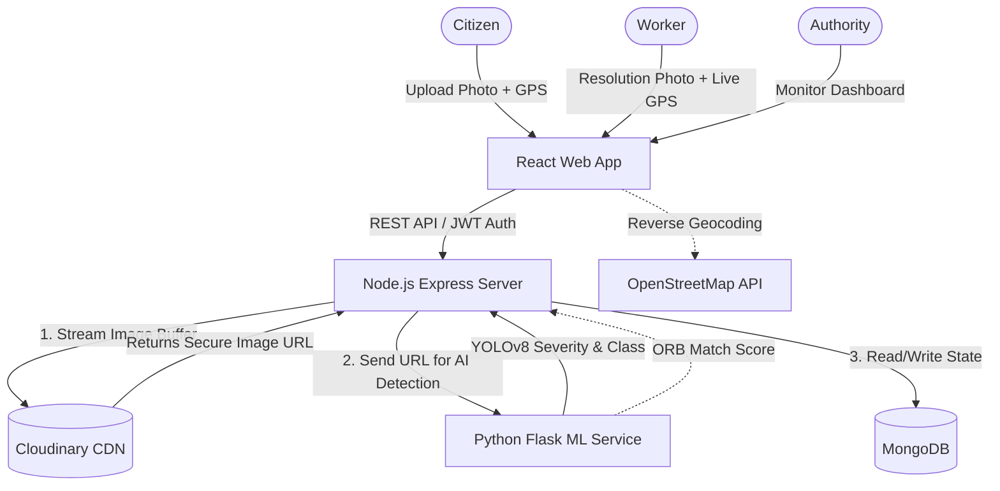
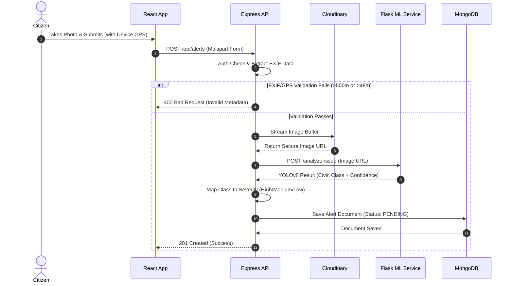
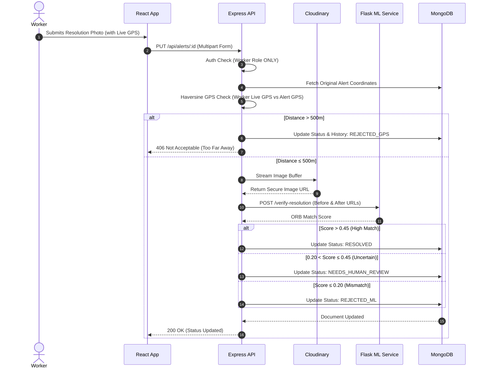

**The Problem**
- Everyday community infrastructure hazards—like potholes, broken streetlights, open manholes, or illegal garbage dumping—often go unreported or take a very long time to get fixed.
- Regular citizens don't have an easy, reliable, and transparent way to report these issues with solid proof to the city authorities.

**The Solution((GuardianAI))**
- GuardianAI is an app that lets anyone easily report these hazards just by snapping a photo.
- Here is how it makes solving the problem easier:
  - AI Detection: It uses AI to look at your photo and automatically figure out what the problem is.
  - Fake-Report Prevention: It checks the photo's GPS and timestamp to ensure the report is real and actually happened where the user claims.
  - Public Map: It puts all the reported issues on a live, public map so that citizens, workers, and city officials can see exactly what needs to be fixed and track when it gets resolved.

**Functional Requirements**
1. **User Management & Roles:** The system must support user registration and login with distinct role-based access: Citizen, Worker, and Authority.
2. **Incident Reporting:** Citizens must be able to submit hazard reports that include a photo, title, description, and automatically captured GPS coordinates.
3. **AI Hazard Classification:** The system must automatically analyze the uploaded image using a custom YOLOv8 model to classify the civic issue and assign a severity level (High/Medium/Low).
4. **GPS & EXIF Validation (This is from resolution side):** The system must extract EXIF data from uploaded photos to ensure the embedded GPS coordinates match the device's location (within 500m) and the photo is fresh (under 48 hours old).
5. **Interactive Mapping & Public Feed:** The system must provide a real-time public map with multiple views (pins, clusters, severity-based heatmap) and a searchable, filterable live feed of alerts.
6. **Authority Metrics & Oversight:** Authorities must be provided with a dedicated dashboard to view platform metrics, track resolution statistics, and manually review flagged alerts (e.g., `NEEDS_HUMAN_REVIEW`), without having the ability to submit resolutions themselves.
7. **Resolution Submission:** Workers (field staff) must be the only role able to submit a resolution photo to mark an issue as fixed, with the system capturing their live device GPS at submission.
8. **Automated Resolution Verification:** The system must compare the original and resolution photos using ORB feature matching to visually verify they are of the same location.
9. **Audit Trail & Lifecycle Tracking:** The system must track the state of an alert (e.g., PENDING, RESOLVED, REJECTED) and maintain a continuous history log of all state transitions.

**Non-Functional Requirements**
1. **Performance:** The frontend must feel fast and responsive by handling filtering, sorting, and pagination client-side.
2. **Security:** All private API routes must be secured using JWT token verification. User passwords must be securely hashed (bcrypt).
3. **Reliability (Graceful Degradation):** If the AI/ML microservice crashes or is unreachable, the core Node.js server must still accept and save citizen reports without failing.
4. **Usability:** The UI must provide clear feedback via toast notifications, skeleton loading states during data fetches, and intuitive map interactions.
5. **Data Storage Efficiency:** Image uploads must be processed in-memory and piped directly to a CDN (Cloudinary) without saving to the local disk, preventing disk space bottlenecks.

**Edge Cases**
1. **Missing EXIF Data:** Users might upload photos received via messaging apps (which strip EXIF data). The system should handle the missing data gracefully.
2. **Poor Image Lighting:** Photos taken at night or in harsh shadows might degrade AI accuracy. Handled via image preprocessing (CLAHE contrast normalization and sharpening).
3. **Irrelevant AI Detections:** The AI model might confidently detect irrelevant objects (like a person or a dog). Handled by mapping only specific civic classes and discarding the rest.
4. **Altered Camera Angles for Resolutions:** A worker might take the "after" photo from a significantly different angle, failing the automated visual match. The system must flag this for manual review (`NEEDS_HUMAN_REVIEW`) rather than outright rejecting a valid fix.
5. **Remote Resolution Fraud:** A worker might try to mark a hazard as resolved while sitting at home. The system handles this by instantly rejecting resolutions where the worker's live GPS is over 500m away from the hazard.
6. **Concurrent Submissions:** Multiple users submitting reports simultaneously must not cause file mix-ups (handled successfully by using in-memory Multer storage).

Healper:
    - **EXIF data**: stands for Exchangeable Image File Format, a standard that stores metadata about how, when, and where a digital photo was taken.

**Success Criteria**
1. **AI Accuracy:** The custom YOLOv8 model successfully identifies civic hazards with a confidence threshold above 0.30 and correctly maps them to predefined severity categories.
2. **Fraud Prevention:** The EXIF validation successfully rejects citizen reports where the photo is older than 48 hours or the embedded location deviates by more than 500m.
3. **Resolution Integrity:** The system reliably prevents remote resolutions by blocking worker submissions outside a 500m radius, and the ORB visual matching correctly verifies before/after photos.
4. **Role Enforcement:** Strict role boundaries are maintained—Citizens report, Workers resolve, and Authorities only monitor the dashboard and review flagged (NEEDS_HUMAN_REVIEW) items.
5. **System Resiliency:** The core application processes image uploads efficiently (in-memory) and continues to accept reports gracefully even if the Python ML microservice is temporarily down.
6. **SLA Tracking:** The system accurately tracks the 72-hour Service Level Agreement (SLA) for every alert and maintains an immutable audit log for every status transition.

---

## Phase 2: Design

**4. High-Level Solution Architecture**

GuardianAI follows a modern, decoupled three-tier architecture designed for scalability, separation of concerns, and fault tolerance.

### System Components:

1. **Client Tier (React SPA Frontend):** 
   - Handles the User Interface, authentication state (JWT), interactive mapping (React-Leaflet), and device hardware access (Browser Geolocation API).
   - Provides distinct UI experiences based on user roles: Citizen Reporting, Worker Resolution, and Authority Dashboard.

2. **Core API Service (Node.js & Express):**
   - Acts as the central orchestrator and business logic hub. 
   - Manages role-based access control, database CRUD operations, and SLA tracking.
   - Processes image uploads in-memory (Multer) and streams them directly to the CDN.
   - Validates spatial and temporal integrity by extracting EXIF data (`exifr`) from uploads.

3. **ML Microservice (Python Flask):**
   - A dedicated, decoupled service handling heavy computer vision operations.
   - Executes the custom YOLOv8 model to classify hazards and assign severity (`/analyze-issue`).
   - Uses OpenCV ORB feature matching to visually verify "before" and "after" resolution images (`/verify-resolution`).
   - Decoupling ensures the core API remains responsive and can fall back gracefully if the AI is offline.

4. **Data & Storage Layer:**
   - **Database (MongoDB via Mongoose):** Stores User profiles, Alert documents (including the continuous audit history array), and geospatial coordinates.
   - **CDN (Cloudinary):** Stores the actual image binaries, delivering them quickly to the frontend via secure URLs without consuming the backend server's local disk space.

### Architecture Flow Diagram:



**5. Workflow Diagrams**

### 5.1 Citizen Reporting Workflow
This sequence details how a citizen submits a hazard report, from uploading the photo to AI classification and database entry.



### 5.2 Worker Resolution Workflow
This sequence illustrates how a field worker submits a resolution, going through both the strict live GPS gate and the AI visual verification.



**6. Break Into Modules & Services**

To ensure maintainability and separation of concerns, the system is divided into three primary services, each with its own internal modules:

### 6.1 Frontend Service (React SPA)
- **Authentication Module:** Manages login/registration UI, JWT parsing (`jwt-decode`), and role-based route protection (`PrivateRoute`, `AdminRoute`).
- **Geospatial & Mapping Module:** Encapsulates React-Leaflet. Handles map rendering, pin clustering, and severity-weighted heatmaps.
- **Reporting Module:** Manages the alert creation form, interacts with the Browser Geolocation API, and handles image file states before upload.
- **Dashboard & Feed Module:** Displays real-time lists of alerts, utilizing `useMemo` for lightning-fast client-side search, filtering, and pagination.

### 6.2 Backend Core API (Node.js & Express)
- **Auth Service:** Handles bcrypt password hashing, JWT generation, and middleware for role and token verification.
- **Alert Workflow Service:** The core controller managing alert lifecycle states, updating history audit logs, and enforcing SLA deadlines.
- **Media Upload Module:** Configured with Multer (in-memory) to intercept multipart forms and pipe binary streams directly to the Cloudinary CDN.
- **Geospatial Validator:** Contains the `exifr` parsing logic and the Haversine formula functions to execute the 500m distance/48h timestamp checks.

### 6.3 ML Microservice (Python Flask)
- **Image Preprocessing Module:** Uses OpenCV to convert color spaces, apply CLAHE (contrast normalization), and sharpen edges for better AI detection.
- **Civic Detection Module:** Wraps the custom YOLOv8 model (`civic_v1.pt`), filters out low-confidence (<0.30) bounds, and maps raw AI classes to the 7 predefined civic categories.
- **Visual Verification Module:** Handles the ORB feature extraction and `BFMatcher` logic to compute visual similarity scores between 'before' and 'after' resolution images.

**7. Database Schema Design**

GuardianAI uses MongoDB (via Mongoose) as its NoSQL database. The schema is designed to ensure strict role tracking, comprehensive audit logging, and efficient retrieval.

### 7.1 User Schema (`users` collection)
Stores authentication details and role-based access information.
- `_id`: ObjectId
- `name`: String (Required)
- `email`: String (Required, Unique, Indexed)
- `password`: String (Required, securely hashed via bcrypt)
- `role`: Enum `['CITIZEN', 'WORKER', 'AUTHORITY']` (Default: `CITIZEN`)
- `createdAt` / `updatedAt`: Timestamps (Auto-managed by Mongoose)

### 7.2 Alert Schema (`alerts` collection)
The core entity representing a reported hazard, tracking its entire lifecycle from creation to resolution.

**Core Details**
- `_id`: ObjectId
- `userId`: ObjectId (Reference to `User`)
- `title`: String (Required)
- `description`: String (Required)
- `category`: String (Mapped from AI detection or user input)
- `severity`: Enum `['Low', 'Medium', 'High']`
- `latitude`: Number (Required)
- `longitude`: Number (Required)
- `location`: String (Human-readable address from reverse geocoding)

**Media & ML Metadata**
- `mediaUrl`: String (Required, Cloudinary CDN URL for the original report)
- `resolutionImageUrl`: String (Cloudinary CDN URL for the fix, uploaded by Worker)
- `aiConfidence`: Number (YOLOv8 confidence score percentage)
- `mlMetadata`: Object (Stores `detectedIssues` array and `hasValidIssue` boolean from Flask)
- `verificationData`: Object (Stores Citizen EXIF results: distance delta, time delta, pass/fail)
- `verificationScore`: Number (Worker ORB feature matching score between original and resolution image)

**Workflow & Lifecycle Management**
- `status`: Enum `['PENDING', 'RESOLVED', 'REJECTED_GPS', 'REJECTED_ML', 'NEEDS_HUMAN_REVIEW', 'SUSPICIOUS_CONTENT']` (Default: `PENDING`)
- `history`: Array of Objects (Immutable audit trail recording `status`, `actor`, `message`, and `timestamp` for every state change)
- `slaDeadline`: Date (Automatically set to 72 hours from `createdAt`)
- `createdAt` / `updatedAt`: Timestamps (Auto-managed by Mongoose)

**8. API Contracts (Request/Response)**

The system exposes RESTful APIs across the Node.js Core Backend and the Python ML Microservice.

### 8.1 Node.js Core API (`/api`)

#### POST `/api/auth/login`
- **Description:** Authenticates a user and issues a JWT.
- **Request (JSON):**
  ```json
  { "email": "user@example.com", "password": "password123" }
  ```
- **Response (200 OK):**
  ```json
  { "token": "jwt_string_here", "user": { "id": "...", "name": "...", "role": "CITIZEN" } }
  ```

#### POST `/api/alerts`
- **Description:** Citizen submits a new hazard report. Requires `CITIZEN` role.
- **Request (`multipart/form-data`):**
  - `title`: String
  - `description`: String
  - `latitude`: Number (Device GPS)
  - `longitude`: Number (Device GPS)
  - `image`: File (Binary buffer containing EXIF data)
- **Response (201 Created):**
  ```json
  {
    "message": "Alert created successfully",
    "alert": { "id": "...", "status": "PENDING", "severity": "High", "mediaUrl": "..." }
  }
  ```

#### PUT `/api/alerts/:id`
- **Description:** Worker submits a resolution photo. Requires `WORKER` role ONLY.
- **Request (`multipart/form-data`):**
  - `latitude`: Number (Worker Live GPS)
  - `longitude`: Number (Worker Live GPS)
  - `image`: File (Binary buffer of the repaired hazard)
- **Response (200 OK):**
  ```json
  {
    "message": "Resolution verified and status updated",
    "status": "RESOLVED",
    "verificationScore": 0.85
  }
  ```
- **Error Responses:** `406 Not Acceptable` if Worker Live GPS is >500m away (`REJECTED_GPS`).

#### GET `/api/alerts`
- **Description:** Fetch all alerts for the public map and dashboard feed.
- **Response (200 OK):**
  ```json
  [
    { 
      "id": "...", 
      "title": "Pothole", 
      "location": "Main St", 
      "status": "PENDING", 
      "latitude": 12.34, 
      "longitude": 56.78 
    }
  ]
  ```

### 8.2 Python ML Microservice (Internal API)

#### POST `/analyze-issue`
- **Description:** Runs YOLOv8 detection on an uploaded original image.
- **Request (JSON):**
  ```json
  { "imageUrl": "https://res.cloudinary.com/.../before.jpg" }
  ```
- **Response (200 OK):**
  ```json
  {
    "has_issue": true,
    "confidence": 0.89,
    "detected_issues": ["ROAD_DAMAGE_DETECTED"]
  }
  ```

#### POST `/verify-resolution`
- **Description:** Performs ORB visual feature matching between original and resolved images.
- **Request (JSON):**
  ```json
  {
    "originalUrl": "https://res.cloudinary.com/.../before.jpg",
    "resolutionUrl": "https://res.cloudinary.com/.../after.jpg"
  }
  ```
- **Response (200 OK):**
  ```json
  {
    "match_score": 0.65,
    "label": "VERIFIED_RESOLUTION"
  }
  ```
