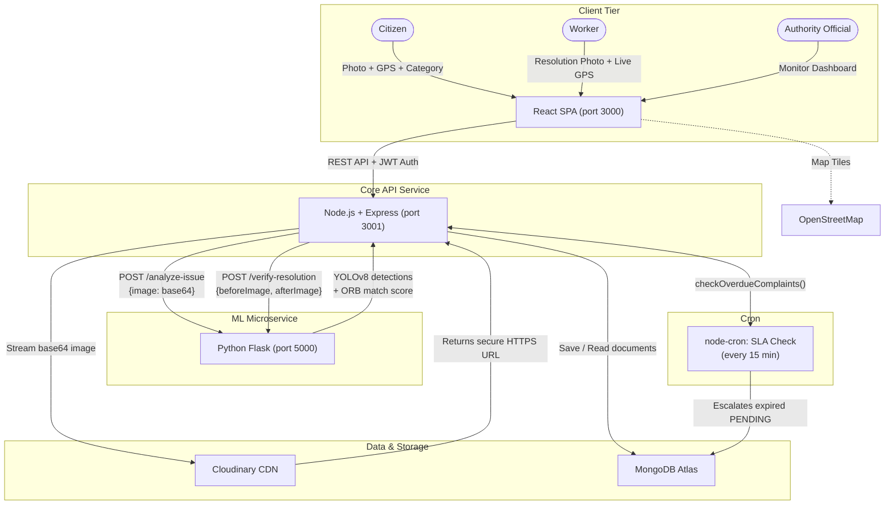

# GuardianAI

## Overview

GuardianAI (operating brand: **CivicProof**) is a full-stack civic reporting platform that lets citizens report infrastructure hazards (potholes, garbage, broken streetlights, etc.) with a photo and GPS coordinates, then uses on-device EXIF validation and a YOLOv8 + OpenCV ML pipeline to verify that the report is real and that any submitted resolution genuinely occurred at the same location.

## Problem

Everyday community infrastructure hazards—potholes, broken streetlights, illegal dumping, fallen trees—go unreported or linger unfixed because citizens have no reliable, transparent channel to file evidence-backed reports, and authorities lack automated tools to detect fraudulent submissions or verify that repairs were done on-site.

## Solution

GuardianAI integrates three layers into a single accountability loop:

1. **Citizen reporting** — a React SPA captures a photo, device GPS, and category; the backend validates EXIF GPS-vs-device distance (≤500 m) and photo freshness (≤48 h) before accepting the report.
2. **AI triage** — a decoupled Python Flask microservice loads a custom `civic_v1.pt` YOLOv8 model (falling back to `yolov8n.pt`) to detect civic objects in the submitted image and maps them to high-level civic categories.
3. **Resolution verification** — when a Worker submits a "before" and "after" photo, the backend enforces a 500 m worker-GPS proximity gate, then the ML service runs ORB keypoint matching (1000 features) to compute a background-similarity score; scores below 0.20 are auto-rejected as suspicious, 0.20–0.45 are flagged for human review, and above 0.45 are verified.

A `node-cron` job runs every 15 minutes to escalate any `PENDING` complaint past its SLA deadline into the audit trail.

## Features

- **Role-based access control** with three roles: Citizen (report), Worker (resolve), Authority (audit-only dashboard)
- **Photo + GPS incident reporting** with live device Geolocation API capture and base64 image upload
- **EXIF GPS validation** — backend extracts GPS/timestamp from the image buffer with the `exifr` library and rejects reports where the photo location is >500 m from the device GPS or the photo is >48 hours old
- **Sequential complaint IDs** — `CP-00001`, `CP-00002`, … generated via a MongoDB Counter collection
- **YOLOv8 hazard classification** — custom `civic_v1.pt` model detects potholes, garbage, graffiti, streetlights; CLAHE contrast normalization + sharpening preprocessing applied before inference
- **ORB visual verification** — before/after resolution photos are compared using OpenCV ORB keypoints (1000 features) and BFMatcher, producing a match score (0.0–1.0) that gates auto-verification
- **Three-tier verification outcome** — auto-verify (>0.45 match), human review (0.20–0.45), or auto-reject (<0.20) with labels `VERIFIED_RESOLUTION`, `NEEDS_HUMAN_REVIEW`, `SUSPICIOUS_DIFFERENT_LOCATION`
- **SLA tracking & auto-escalation** — category-specific deadlines (Pothole: 48h, Garbage: 24h, Streetlight: 72h, etc.); a cron job scans for expired complaints every 15 minutes and logs an escalation event
- **Interactive map dashboard** — React-Leaflet map with color-coded markers (overdue = red pulse, nearing deadline = yellow), filterable by status and category
- **Recurring hotspot detector** — DBSCAN-inspired clustering flags areas with 3+ complaints of the same category within 100 m and 90 days
- **Cloudinary CDN image pipeline** — images are uploaded as base64, streamed directly to Cloudinary (folders `civicproof/complaints` and `civicproof/resolutions`), and served via secure HTTPS URLs
- **Full audit trail** — every status transition is appended to a `history` array with actor, timestamp, and message; visible in the ResolutionHistory component
- **Graceful ML degradation** — if the Python microservice is unreachable, the backend still saves reports and applies a default `SUSPICIOUS_CONTENT` status when no AI analysis is possible
- **Authority verification queue** — authorities see only items needing manual review (`NEEDS_HUMAN_REVIEW`, `VERIFIED_TENTATIVE`) with side-by-side before/after images and manual approve/reject buttons

## Tech Stack

| Layer | Technology | Role |
|---|---|---|
| **Frontend** | React 19 + Vite | SPA framework and dev/build tooling |
| **Frontend** | Tailwind CSS 4 | Utility-first styling with custom dark glassmorphism theme |
| **Frontend** | React-Leaflet 5 | Interactive OpenStreetMap with markers, circles, filtering |
| **Frontend** | Motion / Framer Motion | Page transitions, modal animations, slam-in effects |
| **Frontend** | date-fns | Timestamp formatting, distance, deadline calculations |
| **Frontend** | Lucide React | Icon set (MapPin, ShieldCheck, Camera, etc.) |
| **Frontend** | @google/genai | Optional Gemini 3 Flash verification fallback for resolution images |
| **Frontend** | clsx + tailwind-merge | Conditional className composition |
| **Backend** | Node.js 20 (Express 4) | Core API orchestrator on port 3001 |
| **Backend** | Mongoose 9 | MongoDB ODM with schemas for User, Complaint, Counter |
| **Backend** | bcryptjs | Password hashing (12 rounds) |
| **Backend** | jsonwebtoken | JWT-based session auth (7-day expiry) |
| **Backend** | exifr | EXIF GPS/timestamp extraction from image buffers |
| **Backend** | cloudinary (npm) | Image upload to CDN from base64 payloads |
| **Backend** | node-cron | SLA-overdue check every 15 minutes |
| **Backend** | cors + dotenv | CORS middleware and environment configuration |
| **ML Service** | Python 3.9 (Flask) | Decoupled CV microservice on port 5000 |
| **ML Service** | Ultralytics YOLO | Custom `civic_v1.pt` + fallback `yolov8n.pt` weights |
| **ML Service** | OpenCV (opencv-python-headless) | CLAHE preprocessing, ORB keypoints, BFMatcher |
| **ML Service** | NumPy + Pillow | Image matrix manipulation and format decoding |
| **Infrastructure** | Docker | Per-service containers (frontend, backend, ML) |
| **Infrastructure** | Docker Compose | Root-level orchestration on ports 3000/3001/5000 |
| **Infrastructure** | Vercel | Frontend static hosting (`outputDirectory: frontend/dist`) |
| **Infrastructure** | MongoDB Atlas | Cloud-hosted NoSQL database (Cluster0) |

## Architecture



### Request Flow

1. **Citizen file report** — The React SPA captures a photo (base64) and device GPS coordinates, then calls `POST /api/complaints`. The Express backend uploads the image to Cloudinary, runs EXIF validation (500 m distance + 48 h freshness), calls `POST /analyze-issue` on the Flask ML service for YOLOv8 classification, assigns an SLA deadline based on category, and saves the complaint document with an audit-trail entry.
2. **Worker submit resolution** — The Worker opens a complaint via `?resolve=CP-XXXXX`, captures a resolution photo and live device GPS. `PATCH /api/complaints/:id/status` first enforces the 500 m proximity gate, then calls `POST /verify-resolution` on the ML service for ORB background matching. Based on the match score (≥0.45 = verified, 0.20–0.45 = human review, <0.20 = rejected) the complaint status is updated and the audit trail is appended.
3. **Authority audit** — The authority dashboard polls the same `/api/complaints` endpoint and renders only items with `NEEDS_HUMAN_REVIEW` or `VERIFIED_TENTATIVE` statuses, allowing manual approve/reject with full before/after comparison.
4. **SLA auto-escalation** — A `node-cron` task fires every 15 minutes (and can be manually triggered via `POST /api/complaints/trigger-sla-check`), finds all `PENDING` complaints past their deadline, and pushes an escalation message into each complaint's `history` array.

## Project Structure

```
GuardianAI/
├── docker/
│   ├── frontend.Dockerfile     # Node 20-alpine, builds Vite app, exposes 3000
│   ├── backend.Dockerfile      # Node 20-alpine, runs Express, exposes 3001
│   └── ml.Dockerfile           # Python 3.9-slim, pip installs requirements, exposes 5000
├── docker-compose.yml          # 3-service orchestration: frontend, backend, ml
├── vercel.json                 # Frontend output: frontend/dist
├── .env                        # Root env (MONGODB_URI)
├── backend/
│   ├── .env                    # Backend secrets: JWT_SECRET, Cloudinary keys, ML_API_URL
│   ├── package.json            # Express, Mongoose, bcrypt, JWT, exifr, cloudinary, node-cron
│   ├── src/
│   │   ├── app.js              # Express server: CORS, 10 mb limits, routes, cron, health
│   │   ├── config/
│   │   │   ├── db.js           # MongoDB connection (Atlas or local fallback)
│   │   │   └── cloudinary.js   # Cloudinary SDK configuration
│   │   ├── models/
│   │   │   ├── User.js         # {name, email, password(hashed), role}
│   │   │   ├── Complaint.js    # Full complaint schema with history, mlMetadata, verificationData
│   │   │   └── Counter.js      # Sequential ID generator (CP-00001 format)
│   │   ├── routes/
│   │   │   ├── auth.js         # /register, /login, /me
│   │   │   └── complaints.js   # /, /:id, /:id/status, /:id (DELETE), /trigger-sla-check
│   │   ├── controllers/
│   │   │   ├── auth.js         # Register/login/getMe with JWT issuance
│   │   │   └── complaints.js   # createComplaint, getComplaints, getComplaintById,
│   │   │                        # updateComplaintStatus (GPS gate + ML verification),
│   │   │                        # deleteComplaint, triggerSLACheck
│   │   ├── services/
│   │   │   ├── slaService.js   # checkOverdueComplaints() — escalates expired PENDING
│   │   │   └── gpsValidator.js # calculateDistanceMeters (Haversine), validateGPSData (EXIF)
│   │   └── scripts/
│   │       └── seed.js         # Seeds 3 demo users (citizen/worker/authority) + 3 complaints
│   └── uploads/                # Local upload artifacts (gitignored)
├── frontend/
│   ├── package.json            # React 19, Vite 6, Tailwind 4, Leaflet, Motion, date-fns
│   ├── vite.config.js          # Aliases @, exposes process.env.GEMINI_API_KEY, HMR toggle
│   ├── index.html
│   └── src/
│       ├── main.jsx            # Entry point with AuthProvider + NotificationProvider
│       ├── App.jsx             # Root component: routing via activeTab, complaint state mgmt
│       ├── types.js            # COMPLAINT_CATEGORIES + SLA_HOURS lookup
│       ├── index.css           # Tailwind + dark glassmorphism theme + map filter inversion
│       ├── services/
│       │   ├── api.js          # complaintService: CRUD wrapper around fetch()
│       │   └── geminiService.js # Gemini 3 Flash resolution verification (optional)
│       ├── lib/
│       │   ├── utils.js        # cn() — clsx + tailwind-merge
│       │   └── gpsUtils.js     # Haversine distance, isLocationMatch (50 m threshold)
│       ├── contexts/
│       │   ├── AuthContext.jsx       # JWT token storage, login/register/logout, /me restore
│       │   └── NotificationContext.jsx # In-app notifications via localStorage
│       ├── components/
│       │   ├── Header.jsx
│       │   ├── BottomNav.jsx
│       │   ├── Sidebar.jsx
│       │   ├── MapComponent.jsx      # React-Leaflet map, filters, hotspot clustering
│       │   ├── ReportForm.jsx        # Citizen intake: camera/gallery, GPS, category, description
│       │   ├── ResolutionForm.jsx    # Worker intake: camera/gallery, live GPS verification
│       │   ├── ComplaintDetail.jsx   # Full detail view with before/after, audit trail
│       │   ├── ComplaintList.jsx     # Searchable, sortable complaint grid
│       │   ├── ResolutionHistory.jsx # Timeline of status changes
│       │   ├── NotificationList.jsx  # Slide-in notification panel
│       │   └── ErrorMessage.jsx      # Animated inline error banner
│       └── pages/
│           ├── MapPage.jsx
│           ├── ReportPage.jsx
│           ├── ReportsPage.jsx
│           ├── ComplaintViewPage.jsx
│           ├── ProfilePage.jsx
│           ├── AuthPage.jsx          # Login/register with demo quick-login buttons
│           └── AuthorityDashboardPage.jsx
└── ml/
    ├── requirements.txt          # flask, flask-cors, numpy, pillow, ultralytics, opencv-python-headless
    ├── ml_api.py                 # Flask entry: /analyze-issue, /verify-resolution
    ├── civic_v1.pt               # Custom-trained YOLOv8 weights (pothole, garbage, graffiti, etc.)
    ├── yolov8n.pt                # Fallback YOLOv8 nano weights
    ├── src/
    │   ├── ml_api.py             # Minimal placeholder API (legacy)
    │   ├── visual_detector.py    # Core: enhance_image (CLAHE), map_to_civic_category,
    │   │                         #   load_image_from_any_source, calculate_background_similarity (ORB),
    │   │                         #   analyze_image, verify_resolution_images
    │   └── inspect_model.py      # Quick model class-label dump
    └── test_images/
        ├── pothole_before.png / pothole_after.png
        ├── garbage_before.png / garbage_after.png
        └── bench_before.png
```

| Folder | Responsibility |
|---|---|
| `docker/` | Per-service Dockerfiles (Node 20-alpine frontend/backend, Python 3.9-slim ML) |
| `docker-compose.yml` | Root orchestration linking frontend (3000), backend (3001), ML (5000) |
| `backend/src/app.js` | Express server entry — middleware, route mounting, cron scheduling, health endpoint |
| `backend/src/routes/` | HTTP route definitions for auth and complaints |
| `backend/src/controllers/` | Business logic: complaint CRUD with gatekeeping and ML orchestration |
| `backend/src/models/` | Mongoose schemas for User, Complaint (with embedded history & verification), Counter |
| `backend/src/services/` | SLA scheduler and GPS/EXIF validator (Haversine + exifr) |
| `backend/src/config/` | DB connection and Cloudinary configuration |
| `backend/src/scripts/seed.js` | Demo data seeder (3 users, 3 complaints) |
| `frontend/src/App.jsx` | Root React component — tab routing, complaint state, URL param resolution |
| `frontend/src/services/` | API client wrapper and Gemini AI verification service |
| `frontend/src/contexts/` | Auth (JWT localStorage) and Notification (localStorage) context providers |
| `frontend/src/components/` | Reusable UI components (form, list, map, detail, auth) |
| `frontend/src/pages/` | Top-level page components for each tab / role |
| `frontend/src/lib/` | Utility functions (className merge, GPS distance) |
| `ml/src/visual_detector.py` | YOLOv8 detection, CLAHE preprocessing, ORB feature matching, resolution verification |
| `ml/ml_api.py` | Flask API exposing `/analyze-issue` and `/verify-resolution` |
| `ml/*.pt` | Pre-trained model weights (custom civic model + YOLOv8n fallback) |

## Installation & Setup

### Prerequisites

| Requirement | Minimum | Notes |
|---|---|---|
| Node.js | 20.x (LTS) | Required by frontend (Vite) and backend (Express) |
| npm / yarn | npm 10+ | Workspace support in root `package.json` |
| Python | 3.9+ | ML microservice |
| MongoDB | 6.0+ | Local instance or MongoDB Atlas cluster |
| Docker | 24+ | Only for containerized deployment |
| Cloudinary account | Free tier | For image CDN uploads |
| Google AI API key | — | Optional, only for Gemini fallback verification |

### 1. Environment Configuration

**Root `.env`** (shared workspace):

```env
MONGODB_URI=mongodb://127.0.0.1:27017/civicproof
# OR the provided Atlas connection string
```

**Backend `.env`** (`backend/.env`):

```env
PORT=3001
MONGODB_URI=<Your-MONGODB-URI>
CLOUDINARY_CLOUD_NAME=<your-cloudinary-cloud-name>
CLOUDINARY_API_KEY=<your-cloudinary-api-key>
CLOUDINARY_API_SECRET=<your-cloudinary-api-secret>
JWT_SECRET=civicproof-super-secret-jwt-key-2024
ML_API_URL=http://localhost:5000
```

**Frontend `.env`** (optional — Vite env):

```env
VITE_API_URL=http://localhost:3001
GEMINI_API_KEY=<your-gemini-api-key>
```

### 2. Install Dependencies

```bash
# Root workspace install (frontend + backend)
npm install

# ML microservice
cd ml
pip install -r requirements.txt
```

### 3. Database Setup

GuardianAI uses MongoDB. The backend auto-connects to `MONGODB_URI`. To seed demo data:

```bash
# Backend must be running or MongoDB must be reachable
node backend/src/scripts/seed.js
```

Seeded demo accounts:

| Role | Email | Password |
|---|---|---|
| Citizen | `citizen@demo.com` | `password123` |
| Worker | `worker@demo.com` | `password123` |
| Authority | `authority@demo.com` | `password123` |

### 4. Running the Stack

**All services in parallel (recommended for dev):**

```bash
npm run dev
```

This runs:
- Frontend — Vite dev server at `http://localhost:3000`
- Backend — Express on `http://localhost:3001`
- ML Service — Flask on `http://localhost:5000`

Or run individually:

```bash
# Terminal 1 — Frontend
npm run dev -w frontend

# Terminal 2 — Backend
npm run dev -w backend

# Terminal 3 — ML Service
cd ml && python ml_api.py
```

**Dockerized deployment:**

```bash
docker compose up --build
```

| Service | URL | Purpose |
|---|---|---|
| Frontend | `http://localhost:3000` | React SPA (dev or preview) |
| Backend | `http://localhost:3001` | Express API (`/api/auth`, `/api/complaints`, `/api/health`) |
| ML Service | `http://localhost:5000` | Flask CV service (`/analyze-issue`, `/verify-resolution`) |

## Usage

### Citizen Workflow

1. **Sign in** at `http://localhost:3000` — use the demo buttons or register a new account with role `CITIZEN`.
2. **Open "Report Issue"** (bottom nav or sidebar) — grant location permission when prompted (the form auto-acquires GPS).
3. **Take a photo** of the hazard (camera capture or gallery upload), select a category (`Pothole`, `Garbage`, `Streetlight`, `Water Leakage`, `Fallen Tree`, `Other`), and optionally add a description.
4. **Confirm & file** — the confirmation modal shows your category, coordinates, and photo preview. Click "Confirm & File."
5. **Track progress** — the report appears in "My Reports" with an SLA countdown badge (On Track / Warning / Critical). The map pin turns red when overdue.
6. **View audit trail** — click any report card to see the full before/after comparison, ML verification score, and every status transition logged by the system.

### Worker Workflow

1. **Sign in** as `worker@demo.com` / `password123`.
2. **Open the complaint** you're dispatching to — either from "My Reports" list or via the direct URL `?resolve=CP-00001`.
3. **Submit resolution** — take a photo at the site and confirm your live GPS location. The backend immediately checks if you're within 500 m of the original hazard.
4. **Review verification result** — after submission, the complaint status updates to one of: `RESOLVED` (auto-verified), `NEEDS_HUMAN_REVIEW`, or `REJECTED_ML` (suspicious location).
5. **Handle rejections** — if GPS or ML gates reject the submission, re-take the photo closer to the site.

### Authority Workflow

1. **Sign in** as `authority@demo.com` / `password123`.
2. **Open "Verification Queue"** — only complaints flagged as `NEEDS_HUMAN_REVIEW` or `VERIFIED_TENTATIVE` appear.
3. **Compare before/after images** side by side, check the ML match score, and click **Approve Fix** or **Reject Fraud**.
4. **Monitor SLA escalations** — the dashboard shows critical/overdue tickets with red pulse markers.

### Sample Data

If you seed the database (`node backend/src/scripts/seed.js`), you get:

| ID | Category | Status | Demo Purpose |
|---|---|---|---|
| `CMPT-1001` | Pothole | `NEEDS_HUMAN_REVIEW` | Worker claimed fixed, ML flagged same image |
| `CMPT-1002` | Garbage Dump | `PENDING` | Available for worker resolution |
| `CMPT-1003` | Streetlight | `RESOLVED` | Verified with 0.99 ORB score |

## Screenshots

> Drop image files into a `screenshots/` directory at the project root and they will appear below. The README references filenames dynamically — no manual linking required once files are present.

```
screenshots/
├── 01-auth-page.png
├── 02-report-form.png
├── 03-map-view.png
├── 04-complaint-detail.png
├── 05-resolution-form.png
├── 06-authority-dashboard.png
└── 07-profile-page.png
```


## API Documentation

### Backend API (Node.js / Express — port 3001)

Base URL: `http://localhost:3001/api`

#### Health Check

```
GET /api/health
```

- **Auth:** None
- **Response (200):**
```json
{ "status": "ok" }
```

---

#### Auth Endpoints

##### Register

```
POST /api/auth/register
```

- **Auth:** None
- **Request body (JSON):**

| Field | Type | Constraints |
|---|---|---|
| `name` | string | required |
| `email` | string | required, unique, must match email format |
| `password` | string | required, min 6 characters |
| `role` | string | optional — `CITIZEN`, `WORKER`, `AUTHORITY` (defaults to `CITIZEN`) |

```json
{
  "name": "Jane Citizen",
  "email": "jane@example.com",
  "password": "secure123",
  "role": "CITIZEN"
}
```

- **Response (201):**
```json
{
  "token": "eyJhbGciOiJIUzI1NiIsInR5cCI6IkpXVCJ9...",
  "user": {
    "uid": "64a1b2c3d4e5f6a7b8c9d0e1",
    "name": "Jane Citizen",
    "email": "jane@example.com",
    "role": "CITIZEN"
  }
}
```

| Error | Status | Condition |
|---|---|---|
| `All fields are required.` | 400 | Missing name/email/password |
| `Password must be at least 6 characters.` | 400 | Password too short |
| `An account with this email already exists.` | 409 | Duplicate email |

---

##### Login

```
POST /api/auth/login
```

- **Auth:** None
- **Request body (JSON):**

| Field | Type | Constraints |
|---|---|---|
| `email` | string | required |
| `password` | string | required |

```json
{ "email": "citizen@demo.com", "password": "password123" }
```

- **Response (200):** Same shape as register response — `{ token, user }`
- **Error:** `Invalid email or password.` (401) if credentials don't match.

---

##### Get Current User

```
GET /api/auth/me
```

- **Auth:** Bearer token required
- **Response (200):**
```json
{
  "uid": "64a1b2c3d4e5f6a7b8c9d0e1",
  "name": "Jane Citizen",
  "email": "jane@example.com",
  "role": "CITIZEN"
}
```
- **Error:** `Not authenticated.` (401) if no bearer token.

---

#### Complaints Endpoints

##### List All Complaints

```
GET /api/complaints
```

- **Auth:** None (public feed)
- **Response (200):** Array of full complaint objects, sorted newest-first.
```json
[
  {
    "_id": "64a1b2c3d4e5f6a7b8c9d0e2",
    "id": "CP-00001",
    "userId": "64a1b2c3d4e5f6a7b8c9d0e1",
    "category": "Pothole",
    "description": "Massive pothole on main street.",
    "imageUrl": "https://res.cloudinary.com/<your-cloud-name>/image/upload/v1234567890/civicproof/complaints/abc123.webp",
    "latitude": 12.9716,
    "longitude": 77.5946,
    "timestamp": "2024-08-01T10:30:00.000Z",
    "slaDeadline": "2024-08-03T10:30:00.000Z",
    "status": "NEEDS_HUMAN_REVIEW",
    "mlMetadata": {
      "detectedIssues": [
        { "label": "ROAD_DAMAGE_DETECTED", "confidence": 0.88, "box": [120, 85, 320, 260] }
      ],
      "hasValidIssue": true
    },
    "verificationData": {
      "isValid": true,
      "distanceMeters": 42,
      "timeDifferenceHours": 0.5,
      "reason": "Valid EXIF(GPS) Data"
    },
    "history": [
      {
        "status": "PENDING",
        "timestamp": "2024-08-01T10:30:00.000Z",
        "user": "Jane Citizen",
        "message": "Complaint filed."
      }
    ],
    "createdAt": "2024-08-01T10:30:00.000Z",
    "updatedAt": "2024-08-01T11:15:00.000Z"
  }
]
```

---

##### Create Complaint

```
POST /api/complaints
```

- **Auth:** None (citizen reports)
- **Request body (JSON):**

| Field | Type | Constraints |
|---|---|---|
| `category` | string | required — one of: `Pothole`, `Garbage`, `Streetlight`, `Water Leakage`, `Fallen Tree`, `Other` |
| `description` | string | optional |
| `imageUrl` | string | required — base64 data URI (`data:image/jpeg;base64,...`) or HTTPS URL |
| `latitude` | number | required — device GPS latitude |
| `longitude` | number | required — device GPS longitude |
| `slaDeadline` | string (ISO) | optional — auto-calculated by frontend based on category |
| `status` | string | optional — auto-set based on AI analysis |
| `history` | array | optional — auto-generated if omitted |
| `userId` | string | optional — defaults to `"anonymous"` |

```json
{
  "category": "Garbage",
  "description": "Trash overflowing from bin on 5th street.",
  "imageUrl": "data:image/jpeg;base64,/9j/4AAQSkZJRgABAQAAAQABAAD/2wBDAAgGB...",
  "latitude": 12.9720,
  "longitude": 77.5950,
  "userId": "64a1b2c3d4e5f6a7b8c9d0e1"
}
```

- **Response (201):** The saved complaint document (same shape as list items above).
- **Internal flow:** base64 image → Cloudinary upload → EXIF validation → ML `POST /analyze-issue` → status auto-set.

---

##### Get Complaint by ID

```
GET /api/complaints/:id
```

- **Auth:** None
- **Path param:** `id` — the sequential complaint ID (e.g., `CP-00001`)
- **Response (200):** Full single complaint object (same shape as list items).
- **Error:** `Complaint not found` (404).

---

##### Update Complaint Status

```
PATCH /api/complaints/:id/status
```

- **Auth:** None (in current implementation — production should require worker JWT)
- **Path param:** `id` — complaint ID
- **Request body (JSON):** All fields optional; key fields:

| Field | Type | Purpose |
|---|---|---|
| `status` | string | New status (e.g., `RESOLVED`) |
| `resolutionImageUrl` | string | base64 data URI or HTTPS URL of the "after" photo |
| `resolutionLatitude` | number | Worker live GPS latitude |
| `resolutionLongitude` | number | Worker live GPS longitude |
| `verificationScore` | number | Overridden by ML result |
| `verificationLabel` | string | Overridden by ML result |
| `history` | array | Appended to existing history |

```json
{
  "status": "RESOLVED",
  "resolutionImageUrl": "data:image/jpeg;base64,/9j/4AAQ...",
  "resolutionLatitude": 12.9718,
  "resolutionLongitude": 77.5948
}
```

- **Response (200):** Updated complaint document.
- **Gatekeeping flow:**
  - Worker GPS is checked against complaint GPS (Haversine — if >500 m, returns 406 with `REJECTED_GPS`).
  - Resolution image is sent to Cloudinary.
  - ML `POST /verify-resolution` is called with before + after image URLs.
  - Based on the orb score, status is set to `VERIFIED_RESOLUTION`, `NEEDS_HUMAN_REVIEW`, `UNCERTAIN_LOCATION`, or `REJECTED_ML`.

| Error | Status | Condition |
|---|---|---|
| `Complaint not found` | 404 | Invalid complaint ID |
| `Worker is too far from the site: <dist>m (Limit: 500m)` | 406 | GPS gate failed |
| `ML Verification Service is offline.` | 503 | Python service unreachable |

---

##### Delete Complaint

```
DELETE /api/complaints/:id
```

- **Auth:** None (ownership check via `userId` in body)
- **Path param:** `id` — complaint ID
- **Request body (JSON):**

| Field | Type | Constraints |
|---|---|---|
| `userId` | string | required — must match the complaint's `userId` |

```json
{ "userId": "64a1b2c3d4e5f6a7b8c9d0e1" }
```

- **Response (200):**
```json
{ "message": "Complaint deleted successfully" }
```

| Error | Status | Condition |
|---|---|---|
| `Complaint not found` | 404 | Invalid ID |
| `You do not have permission to delete this complaint.` | 403 | `userId` mismatch |

---

##### Trigger Manual SLA Check

```
POST /api/complaints/trigger-sla-check
```

- **Auth:** None
- **Body:** Empty
- **Response (200):**
```json
{ "message": "Successfully escalated 2 overdue complaints." }
```

---

### ML Microservice API (Python Flask — port 5000)

Base URL: `http://localhost:5000`

#### Analyze Image for Hazards

```
POST /analyze-issue
```

- **Request body (JSON):**

| Field | Type | Constraints |
|---|---|---|
| `image` | string | required — base64 data URI or HTTPS URL |

```json
{
  "image": "data:image/jpeg;base64,/9j/4AAQSkZJRgABAQAAAQABAAD/2wBDAAgGB..."
}
```

- **Response (200):**
```json
{
  "success": true,
  "detections": [
    {
      "label": "ROAD_DAMAGE_DETECTED",
      "original_object": "pothole",
      "confidence": 0.89,
      "box": [120, 85, 320, 260]
    }
  ],
  "has_issue": true
}
```

| Field | Description |
|---|---|
| `success` | Always `true` if no exception |
| `detections` | Array of matched civic objects (filtered to relevant categories, confidence ≥ 0.30) |
| `has_issue` | `true` if at least one detection was found |
| `label` | Mapped civic category (`ROAD_DAMAGE_DETECTED`, `WASTE_MANAGEMENT_ISSUE`, `PUBLIC_VANDALISM`, `STREETLIGHT_REPAIR_NEEDED`, `TRAFFIC_OR_PARKING_ISSUE`, `MUNICIPAL_INFRASTRUCTURE`, `WASTE_OR_LITTER_ISSUE`) |
| `confidence` | YOLOv8 confidence score (0.0–1.0) |
| `box` | Bounding box `[x1, y1, x2, y2]` in pixels |

---

#### Verify Resolution (Before/After)

```
POST /verify-resolution
```

- **Request body (JSON):**

| Field | Type | Constraints |
|---|---|---|
| `beforeImage` | string | required — base64 or HTTPS URL |
| `afterImage` | string | required — base64 or HTTPS URL |

```json
{
  "beforeImage": "https://res.cloudinary.com/.../before.jpg",
  "afterImage": "https://res.cloudinary.com/.../after.jpg"
}
```

- **Response (200):**
```json
{
  "score": 0.72,
  "label": "VERIFIED_RESOLUTION",
  "reasoning": "High background match (0.72). The issue is gone.",
  "before_detections": [
    { "label": "ROAD_DAMAGE_DETECTED", "confidence": 0.87, "box": [120, 85, 320, 260] }
  ],
  "after_detections": []
}
```

| Label | Score Range | Meaning |
|---|---|---|
| `VERIFIED_RESOLUTION` | > 0.45 | Same location, issue gone |
| `NEEDS_HUMAN_REVIEW` | > 0.45 | Same location, but issue still visible |
| `VERIFIED_TENTATIVE` | > 0.45 | Same location, no specific objects detected |
| `UNCERTAIN_LOCATION` | 0.20 – 0.45 | Background similar but angle differs |
| `SUSPICIOUS_DIFFERENT_LOCATION` | < 0.20 | Different location — fraud detected |

---

## Engineering Decisions

### 1. MongoDB vs PostgreSQL

| Aspect | MongoDB (chosen) | PostgreSQL |
|---|---|---|
| Schema flexibility | Complaint history array, ML metadata, and verification sub-documents vary per status — no fixed schema | Would require normalized tables for history, detections, verification data |
| Developer velocity | Single-document reads fetch full complaint + history + audit trail in one query | Would need 3+ joins for the same data |
| Geospatial | Built-in `2dsphere` indexing available if needed | PostGIS extension required |
| Atlas hosting | One-click cluster provisioning with the provided connection string | Self-hosting or managed service extra cost |

### 2. JWT vs Session-Cookie Auth

| Aspect | JWT (chosen) | Server-side session |
|---|---|---|
| Frontend decoupling | SPA stores token in localStorage; no cookie jar management | Would require SSR or proxy for cookie passthrough |
| Statelessness | No server memory pressure; scales horizontally without session store | Redis or sticky sessions needed |
| Mobile readiness | Same token works for future React Native or Flutter clients | Would need separate session handling |

### 3. YOLOv8 (Ultralytics) vs TensorFlow Lite / MediaPipe

| Aspect | YOLOv8 (chosen) | TFLite / MediaPipe |
|---|---|---|
| Civic domain training | `civic_v1.pt` is fine-tuned on infrastructure classes; TFLite would need custom retraining | Would require building a custom object detection pipeline |
| ORB integration | Same Python process handles both detection and feature matching | Would need to orchestrate two separate inference paths |
| Python ecosystem fit | Ultralytics provides a clean 1-line model API; OpenCV integration is native | MediaPipe Graph has steeper setup for non-Google use cases |

### 4. ORB Feature Matching vs SSIM / Template Matching

| Aspect | ORB (chosen) | SSIM / Template Matching |
|---|---|---|
| Angle invariance | ORB keypoints are rotation-invariant (solved in `MapComponent.jsx` and resolution flow) | SSIM is pixel-grid-aligned and fails on rotated/cropped photos |
| Scale invariance | ORB handles scale changes natively | Template matching requires pyramid scanning |
| Lighting robustness | Combined with CLAHE preprocessing, ORB matches survive exposure differences | SSIM is highly sensitive to brightness changes |
| Computational cost | Fast (1000 keypoints, BFMatcher) — runs in under 2 s on CPU | SSIM also fast but less discriminative for verification |

### 5. Base64 Image Upload vs Multipart File

| Aspect | Base64 (chosen) | Multipart form-data |
|---|---|---|
| Frontend simplicity | `FileReader.readAsDataURL` → single JSON POST; no FormData API complexity | Requires restructuring ReportForm and ResolutionForm to use FormData |
| Cloudinary upload | Can pass data URI directly to `cloudinary.uploader.upload()` | Need Multer in-memory buffer then base64 encode for Cloudinary |
| Payload size | ~33% overhead but within the 10 mb Express limit | Slightly smaller payloads but requires stream piping |

### 6. Base64 EXIF Validation (exifr) vs Server-side File Parsing

| Aspect | exifr on Buffer (chosen) | Writing to disk first |
|---|---|---|
| Disk efficiency | EXIF parsed directly from `Buffer.from(base64, 'base64')` — no temp file | Would need to write to `/tmp` or `uploads/` then clean up |
| Security | No file-system exposure of raw uploads | Temporary files risk leakage or disk exhaustion |
| Speed | Single in-memory pass | Two I/O operations (write + read) |

### 7. Docker Compose vs Individual Container Orchestration

| Aspect | Docker Compose (chosen) | Kubernetes / ECS |
|---|---|---|
| Setup complexity | Single `docker-compose.yml` with 3 services | Would need ingress, secrets, configmaps |
| Dev ergonomics | `docker compose up --build` mirrors `npm run dev` behavior | Overkill for a 3-service stack with local development |
| Scaling | Not needed yet — all services are CPU-bound or stateless | Would consider when ML worker scaling is required |

### 8. Claude Code / Vite Dev vs Production Build

| Aspect | Vite dev server (chosen) | Pre-built dist |
|---|---|---|
| HMR | Required for rapid frontend iteration (toggle `DISABLE_HMR` for agent workflows) | No hot reload — must rebuild on every change |
| API proxy | Direct CORS calls to `localhost:3001` | Would need rewrite rules for production path |

### 9. React State Routing vs React Router

| Aspect | Local state tabs (chosen) | React Router |
|---|---|---|
| Tab switching | `activeTab` state in `App.jsx` controls page rendering — no page reload | Would require route definitions for each tab |
| Deep linking | `?resolve=CP-XXXXX` and `?view=CP-XXXXX` URL params handled in `useEffect` | Would need route params + query parsing |
| Complexity | Zero additional dependency — App.jsx at 277 lines handles everything | Adds `<BrowserRouter>`, `<Routes>`, `<Route>` boilerplate |

### 10. Cloudinary vs S3 / Local Disk for Image Storage

| Aspect | Cloudinary (chosen) | AWS S3 / Local disk |
|---|---|---|
| Transformation | Auto format optimization (`f_auto,q_auto`) on URL | Would need to build image processing pipeline |
| Upload simplicity | `cloudinary.uploader.upload(base64)` — one call | S3 needs pre-signed URLs + SDK setup |
| Local dev | No local disk writes; `backend/uploads/` is gitignored | Would accumulate test images locally |
| Free tier | 25 credits/month covers demo usage | S3 has 12-month free tier but adds IAM complexity |

## Testing

### What Is Tested

| Component | Test Type | Framework | Status |
|---|---|---|---|
| Backend Express routes | Manual API testing | curl / Postman | ✅ Functional |
| Complaint CRUD endpoints | Manual | curl / Postman | ✅ Functional |
| Auth flow (register/login/me) | Manual | curl / Postman | ✅ Functional |
| ML `/analyze-issue` endpoint | Manual with test_images | curl | ✅ Functional |
| ML `/verify-resolution` endpoint | Manual with test_images | curl | ✅ Functional |
| GPS validation (Haversine + EXIF) | Manual with seeded complaints | Database inspection | ✅ Functional |
| SLA cron job | Manual trigger | `/api/complaints/trigger-sla-check` | ✅ Functional |
| Frontend AuthContext | Manual browser session | Chrome DevTools | ✅ Functional |
| Frontend complaint lifecycle | Manual end-to-end | Browser + network tab | ✅ Functional |

### How to Run Manual Tests

```bash
# 1. Start all services
npm run dev

# 2. Health check
curl http://localhost:3001/api/health
# Expected: {"status":"ok"}

# 3. Register a user
curl -X POST http://localhost:3001/api/auth/register \
  -H "Content-Type: application/json" \
  -d '{"name":"Test User","email":"test@example.com","password":"test123","role":"CITIZEN"}'

# 4. Create a complaint (use a real base64 image)
curl -X POST http://localhost:3001/api/complaints \
  -H "Content-Type: application/json" \
  -d '{"category":"Pothole","description":"Test pothole","imageUrl":"data:image/png;base64,<...>","latitude":12.9716,"longitude":77.5946,"userId":"test"}'

# 5. List complaints
curl http://localhost:3001/api/complaints

# 6. Trigger manual SLA check
curl -X POST http://localhost:3001/api/complaints/trigger-sla-check

# 7. ML service test
curl -X POST http://localhost:5000/analyze-issue \
  -H "Content-Type: application/json" \
  -d '{"image":"https://images.unsplash.com/photo-1515162816999-a0c47dc192f7?auto=format&fit=crop&q=80&w=800"}'
```

### Coverage Gaps

| Gap | Impact | Recommendation |
|---|---|---|
| No automated unit tests | High | Add Jest for backend, Vitest for frontend |
| No integration test suite for ML endpoints | Medium | Use pytest-flask to mock before/after image pairs |
| No E2E test coverage | High | Wire up Playwright to test full citizen → worker → authority flow |
| No load/performance test for SLA cron | Low | Add Artillery script hitting `/trigger-sla-check` under concurrent complaints |
| No contract tests for ML microservice | Medium | Use Pact or schema-first OpenAPI validation between Node and Flask |
| No test for ORB threshold edge cases (0.19 vs 0.21) | Low | Add fixture images that straddle the 0.20 / 0.45 boundary |
| No frontend test for mobile viewport | Medium | Cypress viewport tests for BottomNav → Sidebar responsiveness |

## Limitations & Future Improvements

### Current Limitations

| # | Limitation | Technical Detail | Impact |
|---|---|---|---|
| 1 | ML service is a cold-start bottleneck | YOLOv8 model loads on Flask startup; first request is slow (~2-5 s) | Degraded UX on first report |
| 2 | No JWT auth enforcement on complaints routes | `GET/POST /api/complaints` are open; auth middleware exists but is not wired | Any client can submit fake complaints |
| 3 | AuthContext stores JWT in localStorage | Vulnerable to XSS; no HttpOnly cookie or refresh-token rotation | Session hijacking risk |
| 4 | No rate limiting | Express has no `express-rate-limit` or IP-based throttling | Brute-force and spam attacks possible |
| 5 | Image processing is synchronous in request path | Cloudinary upload + ML call block the Express event loop | Slow complaint creation (~3-5 s per photo) |
| 6 | ML microservice has no retry/fallback | If Flask crashes, `mlMetadata` stays `{ detectedIssues: [], hasValidIssue: false }` | Reduced trust scoring |
| 7 | No file size validation before upload | 10 mb Express limit catches oversized payloads, but base64 overhead can surprise users | Unexpected 413 errors |
| 8 | No WebSocket or SSE for real-time updates | Frontend polls `GET /api/complaints` on mount only; no live feed | Stale data on shared dashboards |
| 9 | No image type validation | `exifr` fails on non-JPEG/non-EXIF images; error is caught but reason is generic | Poor error messaging to users |
| 10 | No unit tests or CI pipeline | No GitHub Actions, no test runner configured | Untested changes can break routes silently |
| 11 | Gemini verification service is defined but unused | `geminiService.js` exists but `App.jsx` never calls `verifyResolution()` | Dead code — either integrate or remove |
| 12 | Docker images are not multi-stage | Each Dockerfile copies source + node_modules directly — large image size | Slow container builds/deployments |

### Future Roadmap

1. **Add JWT auth middleware** to all complaint routes with role-based guards (`CITIZEN` can only update own, `WORKER` can only resolve, `AUTHORITY` read-only on dashboard).
2. **Migrate JWT to HttpOnly cookies** with a refresh-token flow and silent token rotation to eliminate XSS session theft.
3. **Implement automated test suite** — Jest unit tests for backend controllers, Vitest for frontend utils, and Playwright E2E tests for the full citizen → worker → authority workflow.
4. **Add rate limiting** — `express-rate-limit` on auth endpoints (5 attempts/minute) and complaint creation (10/hour/IP).
5. **Introduce Redis queue** for asynchronous image processing — decouple Cloudinary upload and ML analysis from the request-response cycle using BullMQ or Resque.
6. **Add real-time updates** — integrate Socket.io or Server-Sent Events so the authority dashboard and map update instantly when a new complaint is filed or resolved.
7. **Container image optimization** — use multi-stage Docker builds to reduce final image size by ~60% (builder pattern for both Node and Python).
8. **Add image validation** — validate MIME type, dimensions, and base64 size before decoding; return structured error messages like `Image exceeds 5 MB` or `No EXIF GPS data found`.
9. **Implement Gemini AI verification** — wire `geminiService.js` into the resolution flow as a secondary opinion when ORB score is in the 0.30–0.50 uncertainty band.
10. **Add severity scoring and heatmap** — extend the YOLOv8 output to map detections to `Low/Medium/High` severity and render a Leaflet heatmap layer weighted by severity and age.
11. **Add admin panel** — a dedicated authority UI for viewing platform analytics (resolution rates, SLA breach %, fraud detection stats) and managing worker assignments.
12. **CI/CD pipeline** — GitHub Actions workflow that lints, runs tests, builds Docker images, and pushes to a container registry on merge to `main`.

| License | MIT License — see [LICENSE](LICENSE) file. |
|---|---|

