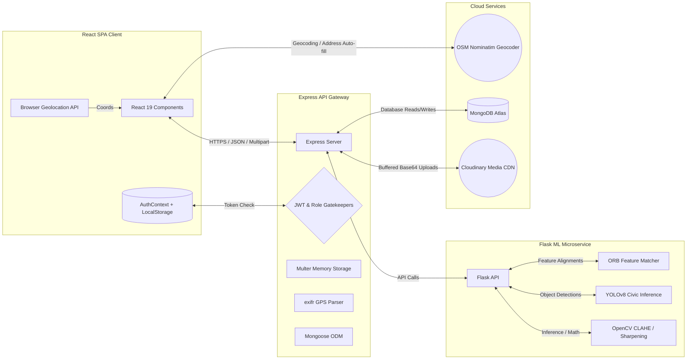

# GuardianAI — System Architecture

This document provides a deep technical analysis of the architectural design, data flows, and processing lifecycles of **GuardianAI** (formerly **CivicProof**).

---

## 1. System Components Overview

GuardianAI utilizes a three-tier decoupled service architecture that separates user presentation, business logic orchestration, and computation-heavy machine learning workflows:



### Component Details
1. **React SPA Client (`/frontend`):** A responsive, dark-themed Single Page Application built on React 19. It communicates asynchronously with the Express API via Axios and with OpenStreetMap's Nominatim service for geocoding. It is the entry point for capturing device-level GPS locations and media file uploads.
2. **Express API Gateway (`/backend`):** A RESTful Node.js service running Express v5. It is the central authority managing JWT validation, role checking, image memory buffering (via Multer), EXIF parsing (via `exifr`), cloud media uploading (via Cloudinary), Mongoose-based MongoDB transactions, and microservice proxying.
3. **Flask ML Microservice (`/ml`):** A Python microservice built with Flask. It executes specialized computer vision pipelines. By utilizing raw matrices of images via OpenCV, it performs lighting enhancements (CLAHE), edge-sharpening, YOLOv8 object detection, and background feature matching (ORB) without state persistence.

---

## 2. Folder Structure Map

The repository is structured logically to separate layers of concerns:

```
GuardianAI/                         # Root workspace
├── backend/                        # Node.js Express REST API
│   ├── config/                     # Configuration scripts (Cloudinary)
│   ├── controllers/                # Business logic (Alerts, Auth)
│   ├── middleware/                 # Route guards (Authentication)
│   ├── models/                     # Database Schemas (User, Alert)
│   ├── routes/                     # REST Route definitions
│   ├── services/                   # Utility layers (EXIF/GPS Validator)
│   ├── scripts/                    # Maintenance & Migration Scripts
│   ├── server.js                   # Application Entry Point
│   └── package.json                # Dependencies & Node scripts
│
├── frontend/                       # React SPA Client
│   ├── public/                     # Static assets (HTML, Icons)
│   ├── src/                        # React source code
│   │   ├── components/             # Reusable UI elements & Routes
│   │   ├── context/                # Global React Contexts (AuthContext)
│   │   ├── pages/                  # Views (Dashboard, Details, Report)
│   │   ├── utils/                  # Utility scripts (Axios Interceptors)
│   │   ├── App.js                  # Main Router & Page mappings
│   │   ├── index.js                # React Root Renderer
│   │   └── index.css               # Core CSS & Utility styling
│   └── package.json                # CRA scripts & packages
│
└── ml/                             # Python Machine Learning Service
    ├── src/                        # Machine Learning Core Logic
    │   └── visual_detector.py      # YOLOv8 & OpenCV Processing Pipelines
    ├── ml_api.py                   # Flask App Entry Point
    ├── civic_v1.pt                 # Domain-Specific YOLOv8 Weights (22.5 MB)
    ├── yolov8n.pt                  # General YOLOv8 Fallback Weights (6.5 MB)
    └── requirements.txt            # Python Dependencies
```

---

## 3. Data Flows & Request Lifecycles

GuardianAI enforces automated gates at key transitions. Below are the sequential lifecycles of core operations.

### Flow A: Alert Creation & AI Triage (Citizen Workflow)

When a resident reports a hazard, the request travels through a multi-step verification pipeline:

```mermaid
sequenceDiagram
    autonumber
    actor Citizen as Citizen User
    participant App as React SPA (Client)
    participant API as Express API (Backend)
    participant exifr as exifr Validator
    participant Cloudinary as Cloudinary CDN
    participant ML as Flask ML Service
    participant DB as MongoDB Atlas

    Citizen->>App: Input Title, Desc & Upload Image
    Note over App: Capture Device GPS coordinates<br/>Reverse-geocode address via Nominatim
    App->>API: POST /api/alerts (Multipart Form-Data + JWT)
    
    rect rgb(20, 30, 50)
        Note right of API: Execution: authMiddleware
        API->>DB: Fetch user by token ID & check exists
        DB-->>API: User details returned (Role: CITIZEN)
    end

    API->>Cloudinary: Upload Image Buffer as Base64 Data URI
    Cloudinary-->>API: Secure Image URL returned

    rect rgb(20, 50, 30)
        Note right of API: Execution: validateGPSData (exifr)
        API->>exifr: Pass Image URL + Device Coordinates
        Note over exifr: Parse EXIF header binary<br/>Calculate Distance (Haversine)<br/>Verify timestamp age (< 48 hours)
        exifr-->>API: Return verificationData (isValid, distance, timeDiff)
    end

    rect rgb(50, 40, 20)
        Note right of API: Execution: analyze-issue
        API->>ML: POST /analyze-issue { image: secure_url }
        Note over ML: Apply YUV CLAHE + Edge Sharpening<br/>Inference YOLOv8 (civic_v1.pt)<br/>Filter confidence < 0.30 & map to Civic labels
        ML-->>API: Return detections list & has_issue (bool)
    end

    alt AI Found No Civic Issues in Image
        Note over API: Set Status = "SUSPICIOUS_CONTENT"
    else AI Validated Civic Issue
        Note over API: Set Status = "PENDING"<br/>Map Category & Severity based on highest confidence label
    end

    Note over API: Calculate SLA Deadline (Date.now + 72 hours)
    API->>DB: Save Alert Document (include mlMetadata, verificationData, history[])
    DB-->>API: Document saved successfully
    API-->>App: JSON Response (Success notification + Alert Details)
    App->>Citizen: Toast Success & Redirect to Dashboard
```



---

### Flow B: Ticket Resolution & Automated Auditing (Worker Workflow)

When field teams submit a hazard fix, the resolution is subjected to dual spatial-visual verification to protect against fraud:

```mermaid
sequenceDiagram
    autonumber
    actor Worker as Worker / Staff User
    participant App as React SPA (Client)
    participant API as Express API (Backend)
    participant DB as MongoDB Atlas
    participant Cloudinary as Cloudinary CDN
    participant ML as Flask ML Service

    Worker->>App: Click "Resolve" -> Take photo of repaired hazard
    Note over App: Capture worker device GPS coordinates
    App->>API: PUT /api/alerts/:id (Resolution Image + Coordinates + JWT)
    
    rect rgb(20, 30, 50)
        Note right of API: Execution: Role Gate
        API->>DB: Verify user role is WORKER or AUTHORITY
        DB-->>API: Verified
    end

    API->>Cloudinary: Upload Resolution Image Buffer to "guardianai/resolutions"
    Cloudinary-->>API: Secure Resolution URL returned

    rect rgb(50, 20, 20)
        Note right of API: Gatekeeper 1: Device Proximity check
        Note over API: Compare alert coordinates vs. worker coordinates (Haversine)
        alt Distance > 500 meters
            Note over API: Set status = "REJECTED_GPS"<br/>Write rejection to Alert history log
            API->>DB: Save Alert Document
            API-->>App: HTTP 406 Error ("Worker is too far from site")
            App->>Worker: Show Rejection Toast (Failed GPS Proximity)
        end
    end

    rect rgb(50, 45, 20)
        Note right of API: Gatekeeper 2: AI Visual verification
        API->>ML: POST /verify-resolution { beforeImage, afterImage }
        Note over ML: Extract ORB Keypoints (up to 1,000 features)<br/>Execute BFMatcher (Hamming distance)<br/>Inference YOLOv8 on "after" image
        Note over ML: Match score = valid_matches / min(keypoints_before, keypoints_after)
        
        alt Background Score > 0.45 AND detections_after == 0
            Note over ML: Return label: "VERIFIED_RESOLUTION" (Success)
        else Background Score > 0.45 AND detections_after > 0
            Note over ML: Return label: "NEEDS_HUMAN_REVIEW" (Ambiguous)
        else Background Score <= 0.20
            Note over ML: Return label: "SUSPICIOUS_DIFFERENT_LOCATION" (Fraud)
        end
        ML-->>API: Return Score, Label, Reasoning, and detections lists
    end

    Note over API: Map Final Status: "RESOLVED", "REJECTED_ML", or "NEEDS_HUMAN_REVIEW"
    Note over API: Append transition details to history audit array
    API->>DB: Update Alert Document
    DB-->>API: Updated successfully
    API-->>App: JSON Response (Updated Alert Document)
    App->>Worker: Show Verification Outcome Notification
```



---

## 4. Authentication & Authorization Flow

GuardianAI protects routes at both client and server boundaries:

*   **Stateless Token Signature:** Users login/register via `/api/auth/register` or `/api/auth/login`. On credential matching, the server signs a JSON Web Token containing `{ id, role }` using `JWT_SECRET` (expiring in 7 days).
*   **Context Persistence:** The React client holds the decoded user profile and raw token in an `AuthContext` state, which synchronizes instantly with browser `localStorage`.
*   **Interception:** Custom Axios interceptors hook all outgoing HTTP requests, attaching the token to headers in the format `Authorization: Bearer <token>`.
*   **Active Boundary Check:** The interceptor decodes the token expiration date client-side. If expired, it triggers an immediate local logout and redirects the user to the login screen, preventing expired requests from hitting the network.
*   **State-Reverification Middleware (`authMiddleware.js`):** Protected Express routes invoke `authMiddleware.js`. To protect against token-replay attacks (e.g., if an account has been deleted or its roles changed but the token remains valid), the middleware extracts the token, verifies the signature, and **re-queries the MongoDB database** for the complete, updated User document (excluding passwords) before assigning it downstream (`req.user = user`).

---

## 5. State Management Flow (React)

Application state is kept simple, performant, and localized to prevent rendering bottlenecks:

*   **Authentication State:** Managed globally by `AuthContext.jsx`. It exposes `user`, `setUser`, `token`, `setToken`, and `logout()`.
*   **Dashboard Filtering (useMemo):** To avoid round-trip API network requests during rapid searching or sorting, the `Dashboard.jsx` leverages React `useMemo` hooks. Sorting (newest/oldest) and text-search queries (title, category, address) are processed in-memory client-side across the pre-cached `alerts` state array, enabling fast updates.
*   **Pagination (8 per page):** Handled locally via computed array indexes. Changing pages triggers index slicing on the `sortedAlerts` array without requiring API re-queries.

---

## 6. External Integrations

GuardianAI relies on three lightweight, cost-free external integrations:

1.  **OpenStreetMap Nominatim API:**
    *   *Usage 1 (Reverse Geocoding):* Used upon alert creation. Converts the coordinate output of `navigator.geolocation` into a human-readable address to pre-fill the Location input.
    *   *Usage 2 (Forward Geocoding Search):* Provides address suggestions inside an autocomplete drop-down list. Suggestions are triggered only after typing three characters to avoid spamming the Nominatim endpoint.
2.  **Cloudinary Media API:**
    *   Allows image files to be stored on an optimized Content Delivery Network. Multer buffers uploads directly to RAM, encodes files as Base64 strings, and uploads them to `guardianai/alerts` or `guardianai/resolutions` folders, returning a HTTPS delivery URL.
3.  **MongoDB Atlas:**
    *   A managed cloud database that persists collections for Users and Alerts, supporting structured schema validation and index lookups.
