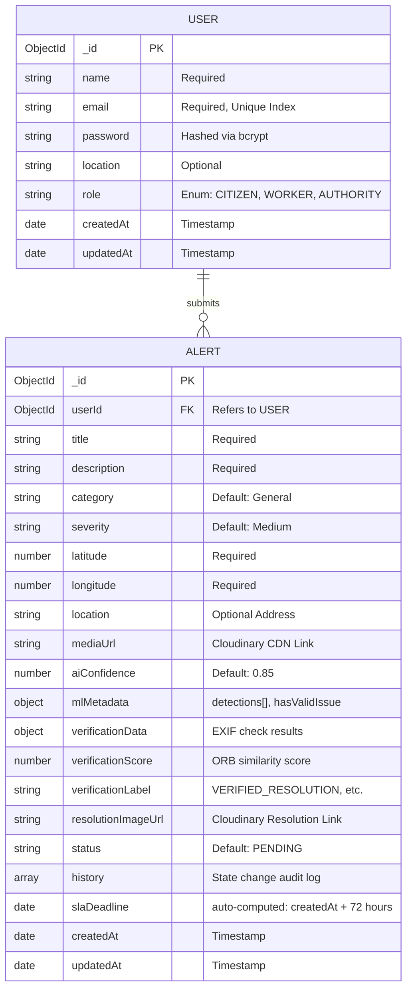

# GuardianAI — Database Model & Schema Reference

This document describes the MongoDB collections, database models, ER relationships, and key queries used by the **GuardianAI** (formerly **CivicProof**) REST API.

---

## 1. Entity-Relationship (ER) Diagram

GuardianAI is backed by a relational-model design implemented over MongoDB's document-oriented architecture:



---

## 2. User Collection Schema

*   **Mongoose Model Name:** `User`
*   **MongoDB Collection Name:** `users`

### Schema Field Specifications

| Field | Type | Rules & Validations | Description |
|---|---|---|---|
| `_id` | ObjectId | Auto-generated | Unique document identifier. |
| `name` | String | `required: true` | The user's full name. |
| `email` | String | `required: true`, `unique: true` | The unique email address used for login. |
| `password` | String | `required: true` | Hashed password (using `bcryptjs` with 10 salt rounds). |
| `location` | String | Optional | The user's general neighborhood or residential zone. |
| `role` | String | `enum: ["CITIZEN", "WORKER", "AUTHORITY"]`, `default: "CITIZEN"` | The user's role, governing access permissions. |
| `createdAt` | Date | Auto-generated timestamp | Record creation date. |
| `updatedAt` | Date | Auto-generated timestamp | Record last modified date. |

---

## 3. Alert Collection Schema

*   **Mongoose Model Name:** `Alert`
*   **MongoDB Collection Name:** `alerts`

### Schema Field Specifications

| Field | Type | Rules & Validations | Description |
|---|---|---|---|
| `_id` | ObjectId | Auto-generated | Unique report identifier. |
| `userId` | ObjectId | `ref: "User"` | The reporter's user reference ID. |
| `title` | String | `required: true` | The incident title. |
| `description` | String | `required: true` | Description of the safety hazard. |
| `category` | String | `default: "General"` | AI-classified category (e.g., `ROAD_DAMAGE_DETECTED`). |
| `severity` | String | `default: "Medium"` | Priority rating: `High`, `Medium`, or `Low`. |
| `latitude` | Number | `required: true` | Device GPS latitude coordinate. |
| `longitude` | Number | `required: true` | Device GPS longitude coordinate. |
| `location` | String | Optional | Nominatim reverse-geocoded human-readable address. |
| `mediaUrl` | String | Optional | Secure delivery URL of the uploaded image on Cloudinary. |
| `aiConfidence`| Number | `default: 0.85` | Confidence rating of YOLOv8 object detection (0.0 to 1.0). |
| `mlMetadata` | Object | `default: { detectedIssues: [], hasValidIssue: false }` | Direct detection bounds and flag markers returned by Flask. |
| `verificationData`| Object| `default: {}` | EXIF check results (isValid, distance delta, age, reasons). |
| `verificationScore`| Number | `default: null` | ORB background matching similarity rating (0.0 to 1.0). |
| `verificationLabel`| String | `default: null` | Output classification of the ORB visual gate. |
| `resolutionImageUrl`| String | `default: null` | Cloudinary URL of the worker's resolution photo. |
| `status` | String | `default: "PENDING"` | Lifecycle state: `PENDING`, `RESOLVED`, `REJECTED_GPS`, `REJECTED_ML`, `NEEDS_HUMAN_REVIEW`, `SUSPICIOUS_CONTENT`. |
| `history` | Array | `default: []` | Timeline subdocument array tracking status modifications. |
| `slaDeadline` | Date | Computed on creation | Resolution deadline (report timestamp + 72 hours). |
| `createdAt` | Date | Auto-generated timestamp | Timestamp when the report was submitted. |
| `updatedAt` | Date | Auto-generated timestamp | Timestamp when the record was last modified. |

### The `history` Subdocument Schema
Every state change appends a new audit log object to the `history` array:
```json
{
  "status": "RESOLVED",
  "timestamp": "2026-06-02T10:00:05.000Z",
  "user": "System_ML_Auditor",
  "message": "Auto-Verified: High background match (0.58). The issue is gone."
}
```

---

## 4. Key Database Queries

### Query 1: Fetch and Sort Feed
Used to build the main dashboard live feed sidebar. It sorts alerts chronologically (newest first):
```javascript
const alerts = await Alert.find().sort({ createdAt: -1 });
```

### Query 2: Fetch Personal Submissions
Used by the citizen dashboard to return their own reported hazards:
```javascript
const myAlerts = await Alert.find({ userId: req.user.id }).sort({ createdAt: -1 });
```

### Query 3: Registering a Hazard Resolution & Appending Audit History
Used inside the resolution endpoint to update status and log details of the transaction in the history timeline:
```javascript
// Example updates for successful visual verification
const updatedAlert = await Alert.findByIdAndUpdate(
  req.params.id,
  {
    $set: {
      status: "RESOLVED",
      resolutionImageUrl: resolutionUrl,
      verificationScore: 0.58,
      verificationLabel: "VERIFIED_RESOLUTION"
    },
    $push: {
      history: {
        status: "RESOLVED",
        timestamp: new Date(),
        user: "System_ML_Auditor",
        message: "Auto-Verified: High background match (0.58). The issue is gone."
      }
    }
  },
  { new: true }
);
```

---

## 5. DB Migration & Administrative History

GuardianAI includes two database patching utilities under the `backend/` directory:

1.  **Standardizing User Roles (`migrate_roles.js`):**
    *   *Background:* Early project iterations used lowercase role values (`'resident'`, `'admin'`).
    *   *Action:* Running `node migrate_roles.js` standardizes these to `CITIZEN` and `AUTHORITY` roles across all collections using bulk updates:
        ```javascript
        await User.updateMany({ role: "resident" }, { $set: { role: "CITIZEN" } });
        await User.updateMany({ role: "admin" }, { $set: { role: "AUTHORITY" } });
        ```
2.  **Patching User Timestamp Metadata (`patch_user.js`):**
    *   *Background:* Older documents were missing auto-generated `createdAt` fields.
    *   *Action:* Running `node patch_user.js` loops through users missing timestamps and sets them to a default registration date:
        ```javascript
        const users = await User.find({ createdAt: { $exists: false } });
        for (const user of users) {
          user.createdAt = new Date();
          await user.save();
        }
        ```
