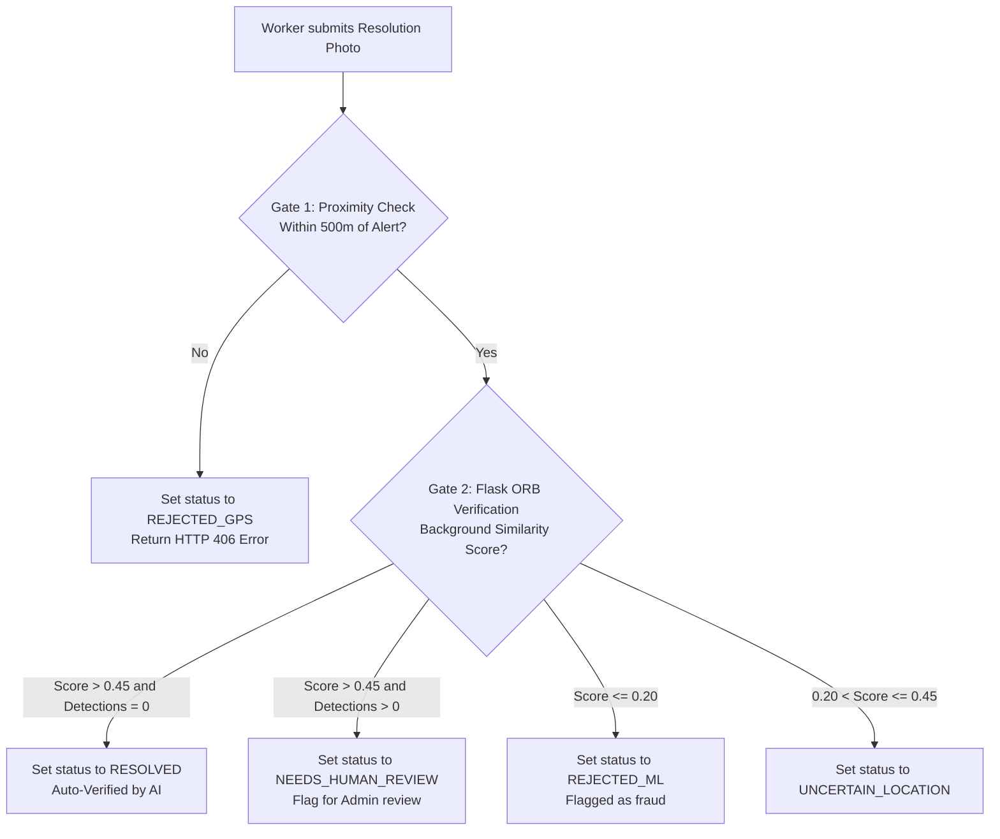

# GuardianAI — Engineering Handover Guide

Welcome to **GuardianAI** (formerly **CivicProof**). This document serves as a transition guide for incoming software engineering teams inheriting the project. It describes system operations, points out critical source files, outlines key workflows, and highlights areas for future development.

---

## 1. What the Project Does

GuardianAI is a full-stack crowdsourced civic hazard reporting and resolution platform. It gives residents a direct, transparent channel to report local safety hazards (such as potholes, open manholes, illegal waste dumping, and broken streetlights) and visualize them on an interactive map.

Unlike traditional civic platforms, GuardianAI uses local machine learning to solve two major operational problems:
1.  **Manual Triage Bottlenecks:** Incoming reports are automatically classified by category and severity using a local **YOLOv8** object detection model.
2.  **Resolution Fraud:** The platform ensures field workers actually visit locations and resolve reported hazards. Submissions must pass a device GPS proximity check (500m limit) and a visual audit using OpenCV **ORB feature matching** to confirm the resolution photo matches the original incident's background.

---

## 2. Core Architecture & Operation

The platform runs as a decoupled, three-service system:
*   **React SPA Client (Port 3000):** Communicates with the Express API via Axios and uses OpenStreetMap's Nominatim service for geocoding and address lookup.
*   **Express API Backend (Port 5050):** Manages user accounts, coordinates database updates on MongoDB Atlas, processes image metadata via `exifr`, uploads images to Cloudinary, and coordinates ML microservice calls.
*   **Flask ML Microservice (Port 5000):** A Python microservice that handles all image processing, running YOLOv8 object detection and ORB feature-matching background comparisons.

---

## 3. Critical Files Index

When onboarding or refactoring, these are the primary files to review:

| Component | Target Source File | Operational Responsibility |
|---|---|---|
| **Backend** | [server.js](file:///c:/Users/ronad/OneDrive/Desktop/Projects/WEB%20+%20ML/GuardianAI/backend/server.js) | Server entry point; manages Mongoose database connections and Express middleware. |
| **Backend** | [Alert.js](file:///c:/Users/ronad/OneDrive/Desktop/Projects/WEB%20+%20ML/GuardianAI/backend/models/Alert.js) | The primary data model defining coordinate structures, ML metadata fields, and the `history` timeline audit log. |
| **Backend** | [alertController.js](file:///c:/Users/ronad/OneDrive/Desktop/Projects/WEB%20+%20ML/GuardianAI/backend/controllers/alertController.js) | Handles core CRUD operations, processes Multer file uploads to Cloudinary, and runs GPS and ML gatekeepers. |
| **Backend** | [gpsValidator.js](file:///c:/Users/ronad/OneDrive/Desktop/Projects/WEB%20+%20ML/GuardianAI/backend/services/gpsValidator.js) | Calculates Haversine distances and extracts EXIF metadata from binary image buffers. |
| **ML Service** | [ml_api.py](file:///c:/Users/ronad/OneDrive/Desktop/Projects/WEB%20+%20ML/GuardianAI/ml/ml_api.py) | Defines the Flask server and its REST routes (`/analyze-issue` and `/verify-resolution`). |
| **ML Service** | [visual_detector.py](file:///c:/Users/ronad/OneDrive/Projects/WEB%20+%20ML/GuardianAI/ml/src/visual_detector.py) | The core image processing pipeline, executing CLAHE filters, YOLOv8 inference, and ORB keypoint comparisons. |
| **Frontend** | [Dashboard.jsx](file:///c:/Users/ronad/OneDrive/Desktop/Projects/WEB%20+%20ML/GuardianAI/frontend/src/pages/Dashboard.jsx) | Renders the Leaflet map (Pins, Clusters, and Heatmap modes) and displays high-level statistics in a live feed sidebar. |
| **Frontend** | [AlertDetails.jsx](file:///c:/Users/ronad/OneDrive/Desktop/Projects/WEB%20+%20ML/GuardianAI/frontend/src/pages/AlertDetails.jsx) | Renders complete report parameters, shows the chronological audit log, and handles worker resolution uploads. |

---

## 4. Key Workflows

### The Resolution Audit Pipeline
To prevent workers from faking resolutions (e.g., photographing a different street to close a ticket), the system enforces a strict dual-gate audit:

### The Image Triage Pipeline
Incoming citizen reports undergo automatic image preprocessing to improve YOLOv8 classification accuracy in difficult real-world lighting conditions:
1.  **Luminance Equalization:** The Flask service converts uploaded images to the YUV color space and applies Contrast Limited Adaptive Histogram Equalization (CLAHE) to the Y (lightness) channel. This normalizes harsh shadows and bright highlights.
2.  **Edge Sharpening:** Applies a 3x3 sharpening filter (`cv2.filter2D`) to make edges crisper, improving YOLOv8's ability to detect fine textures like cracks in road surfaces.
3.  **Civic Mappings:** YOLOv8 detections with confidence above 30% are mapped to civic categories. Reports without detected civic issues are automatically set to `SUSPICIOUS_CONTENT`.

---

## 5. Technical Debt & Design Trade-offs

*   **In-Memory Sorting Bottleneck:** The React dashboard fetches the entire alerts database in a single array and processes sorting, searches, and pagination in-memory client-side. As the database grows to thousands of records, this will become slow.
*   **ORB Perspective Sensitivity:** ORB feature matching is highly sensitive to changes in camera angles. If a worker photographs a repaired pothole from a different perspective than the original photo, the match score may drop below thresholds, triggering false rejections or flagging manual reviews.
*   **Arbitrary Upload Security Risks:** The backend file upload controller does not currently validate file types or sizes before uploading them to Cloudinary.

---

## 6. Future Roadmap & Priority Improvements

### Priority 1: Performance Optimization
*   Implement server-side pagination and geospatial queries in MongoDB (using `$nearSphere` on a `2dsphere` index) to fetch only the alerts within the user's active map viewport.

### Priority 2: Security Hardening
*   Split the general update endpoint (`PUT /api/alerts/:id`) into separate routes for citizen edits and worker resolutions, securing each with strict role-based checks.
*   Configure file filters on Multer uploads to restrict submissions to standard image/video MIME types (JPEG, PNG, MP4) and limit sizes to 10MB.

### Priority 3: Mobile Native Verification App
*   Build native mobile applications for citizens and field workers to capture coordinates and images directly via hardware APIs, preventing EXIF stripping from screenshots or third-party camera apps.

### Priority 4: Real-time Notifications & Retraining Pipelines
*   Integrate Socket.io to alert citizens in real-time when a worker resolves their reported hazard.
*   Implement a retraining pipeline that uses confirmed, successful resolutions as new labeled training data to continuously improve YOLOv8 model accuracy.
