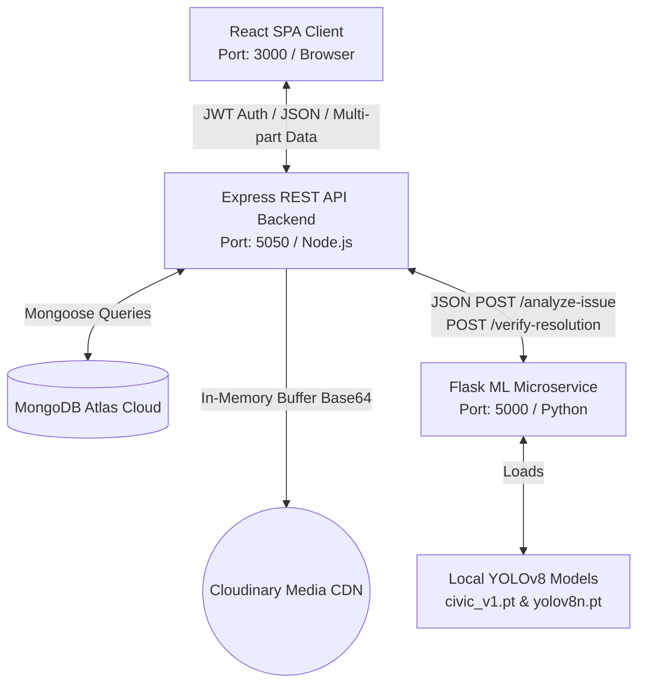

# GuardianAI — Project Overview

GuardianAI (originally known as **CivicProof**) is a state-of-the-art, crowdsourced, GPS-verified civic hazard reporting and resolution platform. It empowers local communities by bridging the communication gap between municipal authorities, field workers, and residents. By combining automated computer vision analysis (using a local **YOLOv8** pipeline) and rigorous spatial-visual auditing, the platform guarantees accountability in the lifecycle of civic complaints—from initial citizen report to certified field resolution.

---

## 1. Business & Civic Problem Solved

In modern cities, infrastructural hazards (such as potholes, open manholes, dangerous waste dumping, public vandalism, and broken streetlights) frequently go unnoticed or unaddressed for extended periods. This is due to three critical gaps in existing solutions:

1. **Slow and Fragmented Government Platforms (e.g., SeeClickFix, municipal 311 apps):**
   * *The Problem:* Operating as slow-moving, bureaucratic ticketing queues, these systems require deep governmental integration to function and lack real-time visibility. Residents are left in the dark regarding status, leading to low engagement and "reporting fatigue."
2. **Emergency/Crime Incident Broadcasters (e.g., Citizen):**
   * *The Problem:* While highly interactive, these apps focus almost exclusively on active, high-severity crimes and active police/fire dispatch audio. They are structurally unsuited for proactively documenting or tracking municipal maintenance hazards.
3. **Unstructured Community Networks (e.g., Nextdoor, Facebook Groups):**
   * *The Problem:* Residents warning neighbors about downed power lines or broken streetlights post unstructured text updates. These posts get buried in feeds alongside general discussions, contain no geospatial data, and support no formal resolution tracking.

### The GuardianAI Solution
GuardianAI fills this vacuum by combining the direct reporting of city 311 systems with the real-time visual maps of incident broadcasters. It embeds:
* **Crowdsourced GPS-Verified Reporting:** Requiring photo verification mapped via device GPS.
* **Intelligent Auto-Triage:** Instantly classifying incoming report categories and severity using local computer vision models to bypass dispatcher bottlenecks.
* **Proximity & Visual Verification Gating:** Automating resolution audits to prevent fraud and guarantee workers actually visited and resolved the reported hazards.

---

## 2. Target Users

GuardianAI serves three distinct user roles, each with custom workflows:

*   **Citizens (Residents):** The eyes of the community. They use the platform to instantly report local safety hazards. By uploading a single photo/video, the system automatically captures exact device coordinates, reverse-geocodes a human-readable address, and submits the report. Citizens can monitor their personal reports via a custom dashboard and view community hazards on a live geospatial map.
*   **Workers (Field Teams):** Municipal maintenance crews. They access active pending tickets, navigate to the site via coordinate plots, and perform repairs. Once fixed, they upload a resolution photograph at the site to trigger the automated verification pipeline.
*   **Authorities (Officers/Administrators):** Municipal department heads. They oversee the entire regional dashboard, review AI-triaged reports, analyze high-severity incident heatmaps, and moderate reports flagged by the system as suspicious or requiring manual inspection.

---

## 3. Core Value Proposition

GuardianAI's technical proposition lies in three key pillars:

*   **Accountability via Dual-Gate Verification:** The system solves "resolution fraud" (where workers or contractors close tickets without fixing them) using two automated gatekeepers:
    *   *Spatial Gate:* Ensures the worker is physically standing within 500 meters of the incident coordinates using device GPS.
    *   *Visual Gate:* Employs OpenCV **ORB feature matching** to confirm the worker's resolution photo matches the background geometry of the original citizen photo.
*   **No-Cost, Privacy-First Local AI:** Devoid of expensive cloud API dependencies (like OpenAI or Google Gemini), the entire machine learning pipeline—including **YOLOv8** object detection and **ORB feature matching**—runs locally on the server host, eliminating usage costs and safeguarding citizen data.
*   **Robust Image Normalization:** The platform processes messy real-world photography taken in dark shadows or harsh sunlight using adaptive histogram equalization (CLAHE) and edge-sharpening kernels in OpenCV, ensuring reliable classification under all conditions.

---

## 4. Major Features

| Feature Area | Key Capability | Implementation Detail |
|---|---|---|
| **Geospatial Dashboard** | Live, interactive Map | Switchable modes: Individual Pins, MarkerClusterGroup clustering, and severity-weighted Heatmaps (`leaflet.heat` utilizing a cyan → yellow → red intensity scale based on hazard severity). |
| **GPS & EXIF Validator** | Anti-Spoofing upload gate | Parses EXIF metadata (`DateTimeOriginal` & GPS) from image files via `exifr` and verifies it matches device GPS within a 500m / 48-hour freshness boundary. |
| **Automated AI Triage** | Instant classification | Preprocesses images with CLAHE and run local YOLOv8 (`civic_v1.pt`) to detect potholes and waste, automatically setting category and severity (High/Medium/Low). |
| **Audit Trails** | Complete Ticket History | An array-based `history[]` audit log inside the MongoDB document that logs every state transition with precise actor and explanation stamps. |
| **Role-Gated Resolution** | Worker & Authority Workflows | Hides and gates action triggers using JWT payloads. Enables workers to submit before/after resolution evidence side-by-side. |

---

## 5. Technology Stack

### Frontend (React SPA)
*   **Framework:** React 19 (compiled via `react-scripts` / Create React App)
*   **Routing:** React Router DOM v7
*   **Maps & Charts:** React Leaflet v5, Leaflet.js v1.9, Leaflet.heat, React-Leaflet-Cluster, Chart.js v4
*   **Styling & Icons:** TailwindCSS v3 (utility styling) + Custom Modern CSS Design System (`index.css`), React Icons
*   **HTTP Client & Utilities:** Axios, jwt-decode, React Hot Toast, React Toastify

### Backend (Node.js REST API)
*   **Engine:** Node.js with Express v5
*   **Database ODM:** Mongoose v8 (MongoDB Atlas)
*   **File Handling:** Multer v2 (configured in-memory buffer storage)
*   **Image Delivery:** Cloudinary SDK v2 (Base64 URI uploading and CDN storage)
*   **EXIF Processing:** `exifr` v7 (binary buffer metadata extraction)
*   **Authentication & Security:** JSON Web Tokens (`jsonwebtoken` v9 with 7-day expiry), `bcryptjs` password hashing

### Machine Learning Service (Python Flask)
*   **Service Engine:** Python 3 with Flask + Flask-CORS
*   **Object Detection:** Ultralytics YOLOv8 (loading fine-tuned weights `civic_v1.pt` [22.5 MB] with fallback to `yolov8n.pt` [6.5 MB])
*   **Computer Vision Preprocessing:** OpenCV (`opencv-python-headless`) for color conversions (YUV space), CLAHE processing, and sharpening filters
*   **Feature Matching:** OpenCV ORB Keypoint detector (up to 1,000 features) and Brute-Force Matcher (Hamming distance)
*   **Core Libraries:** NumPy, Pillow, Roboflow SDK, scikit-learn, TensorFlow

---

## 6. High-Level Architecture

GuardianAI is structured as a decoupled, three-service ecosystem:

1.  **React SPA Client:** Governs presentation, device GPS location gathering, Nominatim geocoding, and user interaction.
2.  **Express API Gateway:** Manages authentication, endpoint authorization, image upload memory-buffering to Cloudinary, database persistence, and coordinates microservice orchestrations.
3.  **Flask ML Service:** Operates as a pure compute microservice, receiving secure media URLs from the API gateway, executing OpenCV matrix filters and YOLOv8 object detections, and performing background alignment verification.

---

## 7. Project Status

The project is currently a **fully functional MVP (Minimum Viable Product)** deployed for evaluation.
*   **Backend Hosting:** Deployed on Render (`https://guardianai-crp4.onrender.com`).
*   **ML Microservice:** Operates as a separate container/process, configured to communicate locally or via a deployed backend route.
*   **Database:** Structured MongoDB Atlas instance containing User and Alert collections.
*   **AI Models:** The custom-trained model `civic_v1.pt` is embedded in the ML folder, ready for direct local execution without any cloud training costs.

---

## 8. Quick Start Summary

For an engineer wanting to launch the platform locally:
1.  **Start MongoDB:** Ensure MongoDB is running locally or obtain an Atlas connection string.
2.  **Run Flask ML Service:** Set up a virtual environment in `/ml`, install `requirements.txt`, and run `python ml/ml_api.py`.
3.  **Run Express API Backend:** In `/backend`, configure the `.env` file (Database URI, JWT secret, Cloudinary keys) and execute `npm install && npm start`.
4.  **Run React Frontend Client:** In `/frontend`, install packages and run `npm start` (or launch concurrently from the root directory using `npm run start`).
